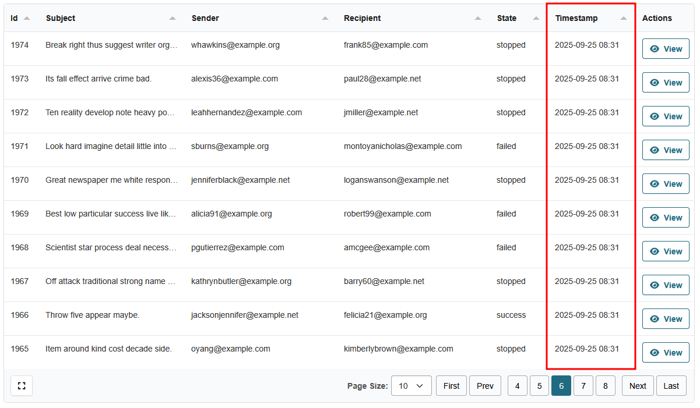
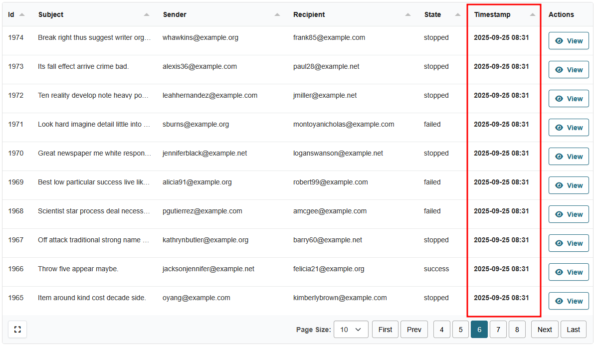

# Formatters

The formatters are used to format the data in the table cells. They can be applied to columns in the table definition.

To see the list of available built-in formatters, see the [Available Built-in Formatters](built-in.md) documentation.

### Usage

Just import the desired formatter and add it to the `formatters` list in the `ColumnDefinition`.

```python
from ckanext.tables.shared import formatters, ColumnDefinition

ColumnDefinition(
    field="timestamp",
    formatters=[(formatters.DateFormatter, {"date_format": "%Y-%m-%d %H:%M"})],
)
```

Result:



----

### Multiple Formatters

It's possible to use multiple formatters on a single column. The formatters will be applied in the order they are defined. For example, to display a date in bold:

```python
from ckanext.tables.shared import formatters, ColumnDefinition

ColumnDefinition(
    field="timestamp",
    formatters=[
        (formatters.DateFormatter, {"date_format": "%Y-%m-%d %H:%M"}),
        (formatters.TextBoldFormatter, {})
    ],
    tabulator_formatter="html",
)
```

!!! note

    If your formatter returns `HTML`, you need to set `tabulator_formatter="html"` on the column definition to allow `HTML` rendering.



----

### Custom Formatters

You can also create your own custom formatters. See the [Custom Formatters](custom.md) documentation for more information.
