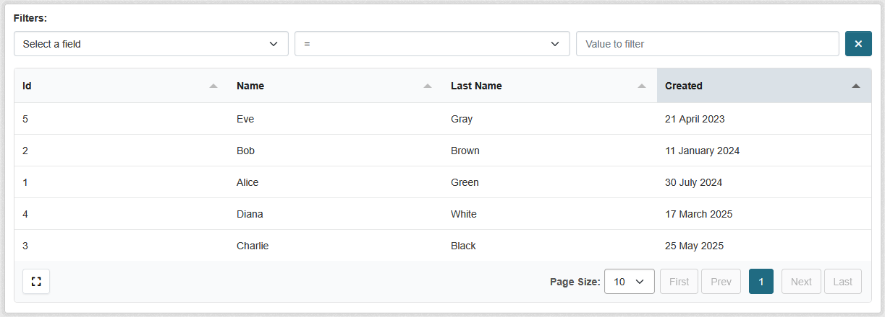

# Basic usage

Here you can find complete usage instructions for the Tables extension. The process is fairly simple and involves only several steps:

1. Defining a Table
2. Registering a Table
3. Creating a view to display the table

## Defining a Table

First, create a table definition by inheriting from `TableDefinition`.

We will use the `ListDataSource` for demonstration purposes, but in a real-world scenario, you might want to use `DatabaseDataSource` or create a custom data source. Read more about data sources [here](data_sources/index.md).

```python
# table.py

from ckanext.tables.shared import (
    ColumnDefinition,
    ListDataSource,
    TableDefinition,
    formatters,
)


class PeopleTable(TableDefinition):
    """Demo table definition for the people table."""

    def __init__(self):
        super().__init__(
            name="people",
            data_source=ListDataSource(
                data=[
                    {"id": 1, "name": "Alice", "surname": "Green", "created": "2024-07-30T15:44:27.801949"},
                    {"id": 2, "name": "Bob", "surname": "Brown", "created": "2024-01-11T08:44:27.801949"},
                    {"id": 3, "name": "Charlie", "surname": "Black", "created": "2025-05-25T21:44:27.801949"},
                    {"id": 4, "name": "Diana", "surname": "White", "created": "2025-03-17T12:44:27.801949"},
                    {"id": 5, "name": "Eve", "surname": "Gray", "created": "2023-04-21T13:44:27.801949"},
                ]
            ),
            columns=[
                ColumnDefinition(field="id"),
                ColumnDefinition(field="name"),
                ColumnDefinition(field="surname", title="Last Name"),
                ColumnDefinition(
                    field="created",
                    formatters=[(formatters.DateFormatter, {"date_format": "%d %B %Y"})],
                ),
            ],
        )
```

### Using Formatters

The tables extension provides several built-in formatters to change the way data is rendered in the table cells. You can apply one or more formatters to a column by specifying them in the `formatters` attribute of `ColumnDefinition`.:

For example, from the above `PeopleTable`, we are using the `datetime` formatter to format the `created` field. So this `2024-02-25T11:10:00Z` value will be displayed as `2024-02-25`.

```python
ColumnDefinition(
    field="created",
    formatters=[("datetime", {"format": "%Y-%m-%d"})],
    sortable=True
),
```

## Registering the Table

To make your table available in the system, register it using the `ISignal` interface in your plugin:

```python
# plugin.py

from typing import Any

from ckan import plugins, types
from ckan.plugins import toolkit as tk

from ckanext.tables_demo.table import PeopleTable


class MyPlugin(plugins.SingletonPlugin):
    plugins.implements(plugins.ISignal)

    # ISignal

    def get_signal_subscriptions(self) -> types.SignalMapping:
        return {
            tk.signals.ckanext.signal("ckanext.tables.register_tables"): [
                self.collect_tables
            ],
        }

    def collect_tables(self, sender: None) -> dict[str, type[Any]]:
        return {"people": PeopleTable}
```

## Creating a View

Once your table is registered, you can create a view to display it using the `GenericTableView`:

```python
# views.py

from flask import Blueprint

from ckanext.tables.shared import GenericTableView


bp = Blueprint("my_tables", __name__, url_prefix="/admin")

bp.add_url_rule(
    "/people",
    view_func=GenericTableView.as_view(
        "people_table",
        table="people",  # Must match the registered table name
    ),
)
```

## Results

After completing the above steps, you can navigate to `/admin/people` in your CKAN instance to see the rendered table.



## Next Steps

- Learn about [Data Sources](data_sources/index.md) for different data backends
- Explore [Built-In](formatters/built-in.md) and [Custom Formatters](formatters/custom.md) to enhance table presentation.
